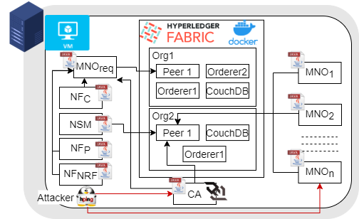

# Network Function Authorization Framework

This project contains the implementation of the proposed decentralized certificate management framework.
Also it contains the required source code for deploying the Hyperledger Fabric blockchain network.

Figure below shows the implementation details

## Instructions to start

- Create the virtual machine using the provided vagrant file.
- SSH and access the virtual machine
- Follow the steps in [Installation](installation/) to install the required binary files
- Run the rebuilt-network-with-chaincode.sh in the network folder
- In the SupportingApplications folder, the codes for NRF, NFConsumer, and NFProducer can be found

